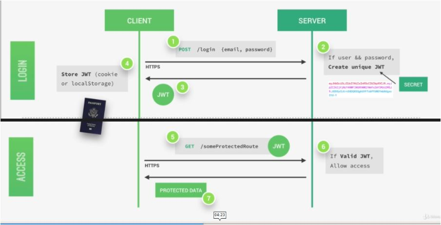

## Introduction to JSON Web Tokens

### What is JSON Web Token?
JSON Web Token (JWT) is an open standard (RFC 7519) that defines a compact and self-contained way for securely transmitting information between parties as a JSON object. This information can be verified and trusted because it is digitally signed.

### When should you use JSON Web Tokens?
- Authorization: This is the most common scenario for using JWT. Once the user is logged in, each subsequent request will include the JWT, allowing the user to access routes, services, and resources that are permitted with that token.

- Information Exchange:  JSON Web Tokens are a good way of securely transmitting information between parties. Because JWTs can be signed—for example, using public/private key pairs—you can be sure the senders are who they say they are.

### What is the JSON Web Token structure?
In its compact form, JSON Web Tokens consist of three parts separated by dots (.), which are:
- Header: The header typically consists of two parts: the type of the token, which is JWT, and the signing algorithm being used.

- Payload: which contains the claims. Claims are statements about an entity (typically, the user) and additional data. There are three types of claims: registered, public, and private claims.
- Signature :To create the signature part you have to take the encoded header, the encoded payload, a secret, the algorithm specified in the header, and sign that.

How do JSON Web Tokens work?
The token is created using a secret string that is stored on a server. Next, the server then sends that JWT back to the client which will store it either in a cookie or in local storage.

 valid Json Web Token which is a bit like a passport to access protected parts of the application.
 Then, each time a user wants to access a protected route like his user profile data, for example. He sends his Json Web Token along with a request, so it's a bit like showing his passport to get access to that route.
 Once the request hits the server, our app will then verify if the Json Web Token is actually valid and if the user is really who he says he is, well then the requested data will be sent to the client and if not, then there will be an error telling the user that he's not allowed to access that resource.

[Home](./README.md) 
