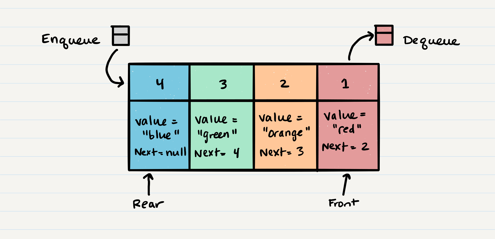

## Stacks and Queues
What is a Stack? A stack is a data structure that consists of Nodes. Each Node references the next Node in the stack.

Common terminology for a stack is:
- Push - Nodes or items that are put into the stack are pushed
- Pop - Nodes or items that are removed from the stack are popped. When you attempt to pop an empty stack an exception will be raised.
- Top - This is the top of the stack.
- Peek - When you peek you will view the value of the top Node in the stack. When you attempt to peek an empty stack an exception will be raised.
- IsEmpty - returns true when stack is empty otherwise returns false.

Stacks follow these concepts:
FILO: First In Last Out This means that the first item added in the stack will be the last item popped out of the stack.

LIFO Last In First Out:
This means that the last item added to the stack will be the first item popped out of the stack

### Stack Visualization

the topmost item is denoted as the top. When you push something to the stack, it becomes the new top. When you pop something from the stack, you pop the current top and set the next top as top.next.

Push O(1): Pushing a Node onto a stack will always be an O(1) operation.

push steps:
- you should have the Node that you want to add.
- assign the next property of the new Node to reference the same Node that top is referencing
- you have to re-assign our reference top to the newly added Node, 

Pop steps:
- create a reference named temp that points to the same Node that top points to.
- you now need to re-assign top to the value that the next property is referencing.

### What is a Queue

Common terminology for a queue is

- Enqueue - Nodes or items that are added to the queue.
- Dequeue - Nodes or items that are removed from the queue. If called when the queue is empty an exception will be raised.
- Front - This is the front/first Node of the queue.
- Rear - This is the rear/last Node of the queue.
- Peek - When you peek you will view the value of the front Node in the queue. If called when - the queue is empty an exception will be raised.
- IsEmpty - returns true when queue is empty otherwise returns false.

### Queue Visualization

