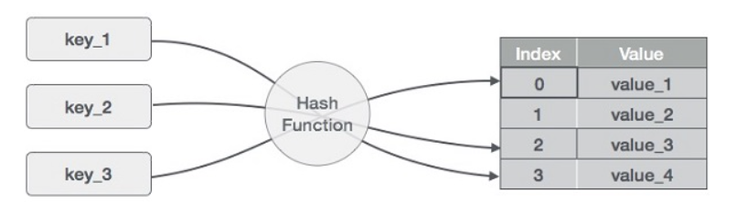

## Basics of Hash Tables
Hashing is a technique that is used to uniquely identify a specific object from a group of similar objects.
A hash table is a data structure that is used to store keys/value pairs. It uses a hash function to compute an index into an array in which an element will be inserted or searched. By using a good hash function, hashing can work well. Under reasonable assumptions, the average time required to search for an element in a hash table is O(1).

To achieve a good hashing mechanism, It is important to have a good hash function with the following basic requirements:
1- Easy to compute: It should be easy to compute and must not become an algorithm in itself.
2- Uniform distribution: It should provide a uniform distribution across the hash table and should not result in clustering.
3- Less collisions: Collisions occur when pairs of elements are mapped to the same hash value. These should be avoided.

What Are they? 
The basic idea of a hashtable is the ability to store the key into this data structure, and quickly retrieve the value. This is done through what we call a hash. A hash is the ability to encode the key that will eventually map to a specific location in the data structure that we can look at directly to retrieve the value.

Why do we use Hash Tables?
- Hold unique values
- Dictionary
- Library

Following are the basic primary operations of a hash table.
- Search − Searches an element in a hash table.
- Insert − inserts an element in a hash table.
- delete − Deletes an element from a hash table.

Hashing is implemented in two steps:
- An element is converted into an integer by using a hash function. This element can be used as an index to store the original element, which falls into the hash table.
- The element is stored in the hash table where it can be quickly retrieved using hashed key.

### Collisions
A collision occurs when more than one key hashes to the same index in an array. As mentioned earlier, a “perfect hash” will never have any collisions. To put this into perspective, the worst possible hash is one that hashes every single key to the same exact index of an array. The more keys you have hashed to a specific index, the more key/value pair combos you can potentially have.

