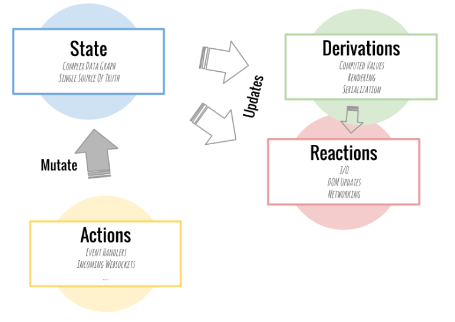

# Redux - Additional Topics
## MobX
MobX is a simple, scalable and battle tested state management solution. This tutorial will teach you all the important concepts of MobX in ten minutes. MobX is a standalone library, but most people are using it with React and this tutorial focuses on that combination.

### The core idea
State is the heart of each application and there is no quicker way to create buggy, unmanageable applications than by producing an inconsistent state or state that is out-of-sync with local variables that linger around. Hence many state management solutions try to restrict the ways in which you can modify state, for example by making state immutable. But this introduces new problems; data needs to be normalized, referential integrity can no longer be guaranteed and it becomes next to impossible to use powerful concepts like classes in case you fancy those.

- First of all, there is the application state. Graphs of objects, arrays, primitives, references that forms the model of your application. These values are the “data cells” of your application.
- Secondly there are derivations. Basically, any value that can be computed automatically from the state of your application. These derivations, or computed values, can range from simple values, like the number of unfinished todos, to complex stuff like a visual HTML representation of your todos. In spreadsheet terms: these are the formulas and charts of your application.
- Reactions are very similar to derivations. The main difference is these functions don't produce a value. Instead, they run automatically to perform some task. Usually this is I/O related. They make sure that the DOM is updated or that network requests are made automatically at the right time.
- Finally there are actions. Actions are all the things that alter the state. MobX will make sure that all changes to the application state caused by your actions are automatically processed by all derivations and reactions. Synchronously and glitch-free.

## Redux Toolkit
The Redux Toolkit package is intended to be the standard way to write Redux logic. It was originally created to help address three common concerns about Redux:

- "Configuring a Redux store is too complicated"
- "I have to add a lot of packages to get Redux to do anything useful"
- "Redux requires too much boilerplate code"

Redux Toolkit also includes a powerful data fetching and caching capability that we've dubbed "RTK Query". It's included in the package as a separate set of entry points. It's optional, but can eliminate the need to hand-write data fetching logic yourself.

### What's Included
- configureStore(): wraps createStore to provide simplified configuration options and good defaults. It can automatically combine your slice reducers, adds whatever Redux middleware you supply, includes redux-thunk by default, and enables use of the Redux DevTools Extension.
- createReducer(): that lets you supply a lookup table of action types to case reducer functions, rather than writing switch statements. In addition, it automatically uses the immer library to let you write simpler immutable updates with normal mutative code, like state.todos[3].completed = true.
- createAction(): generates an action creator function for the given action type string. The function itself has toString() defined, so that it can be used in place of the type constant.
- createSlice(): accepts an object of reducer functions, a slice name, and an initial state value, and automatically generates a slice reducer with corresponding action creators and action types.
- createAsyncThunk: accepts an action type string and a function that returns a promise, and generates a thunk that dispatches pending/fulfilled/rejected action types based on that promise
- createEntityAdapter: generates a set of reusable reducers and selectors to manage normalized data in the store
The createSelector utility from the Reselect library, re-exported for ease of use.